#  Writeup 

## You can use this file as a template for your write-up if you want to submit it as a markdown file, but feel free to use some other method and submit a pdf if you prefer.

---

**Advanced Lane Finding Project**

The goals/steps of this project are the following:

* Compute the camera calibration matrix and distortion coefficients given a set of chessboard images.
* Apply a distortion correction to raw images.
* Use color transforms, gradients, etc., to create a thresholded binary image.
* Apply a perspective transform to rectify binary image ("birds-eye view").
* Detect lane pixels and fit to find the lane boundary.
* Determine the curvature of the lane and vehicle position with respect to the center.
* Warp the detected lane boundaries back onto the original image.
* Output visual display of the lane boundaries and numerical estimation of lane curvature and vehicle position.


## Here I will consider the rubric points individually and describe how I addressed each point in my implementation.  

---

###the implementation can be found [here](./main.ipynb)


## Camera Calibration

### 1. Briefly state how you computed the camera matrix and distortion coefficients. Provide an example of a distortion-corrected calibration image.


#### 1. Prepared the **object points** and **image points**
The **object points** is the (x,y,z) corrdinates of the chessboard corners in the real world.By assuming the chessboard is fixed on the z plane(z=0).Thus the `objp` is as below:
```python
# prepare object points, like (0,0,0), (1,0,0), (2,0,0) ....,(6,5,0)
objp = np.zeros((6*9,3), np.float32)
objp[:,:2] = np.mgrid[0:9,0:6].T.reshape(-1,2)
```  
The **image points** is the corners we detected in the chessboard image as below:
```python
ret, corners = cv2.findChessboardCorners(gray, (9,6),None)
if ret == True:
            objpoints.append(objp)
            imgpoints.append(corners)
            # Draw and display the corners
            annotated_images.append(cv2.drawChessboardCorners(img, (9,6), corners, ret))
```
#### 2. Using those two points sets to calibrate camera:
```python    
ret, mtx, dist, rvecs, tvecs = cv2.calibrateCamera(objpoints, imgpoints, gray.shape[::-1], None, None)
```
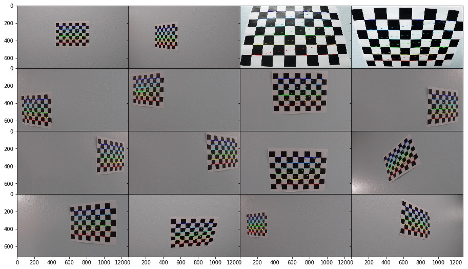

#### 3. Using the `cv2.calibrateCamera` return to `undistort()` the image
```python
def get_undistort_img(img,mtx,dist):
        return cv2.undistort(img, mtx, dist, None, mtx)
```
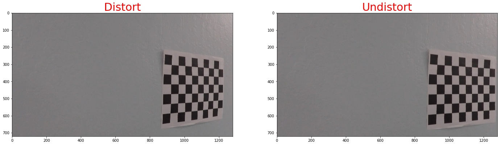
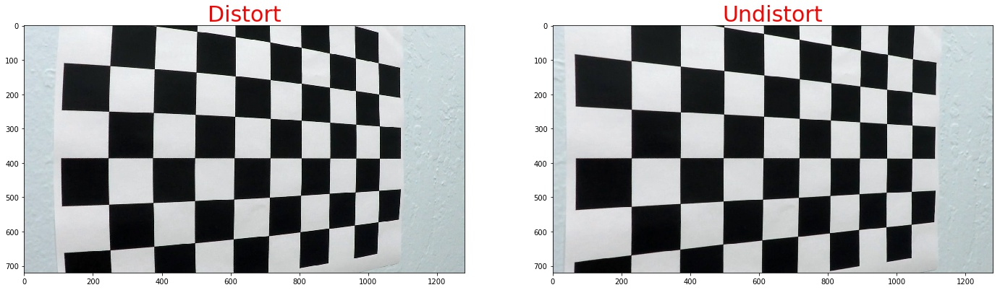


#### 4. Then we apply the measurement to our test images
here I will show you some of the iamges
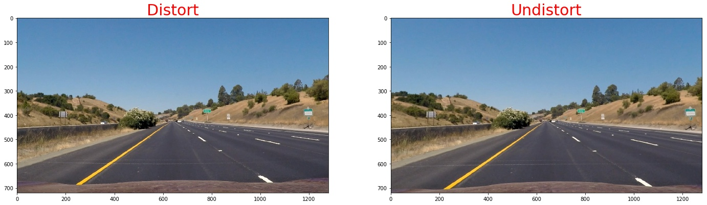
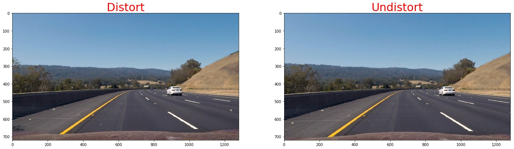
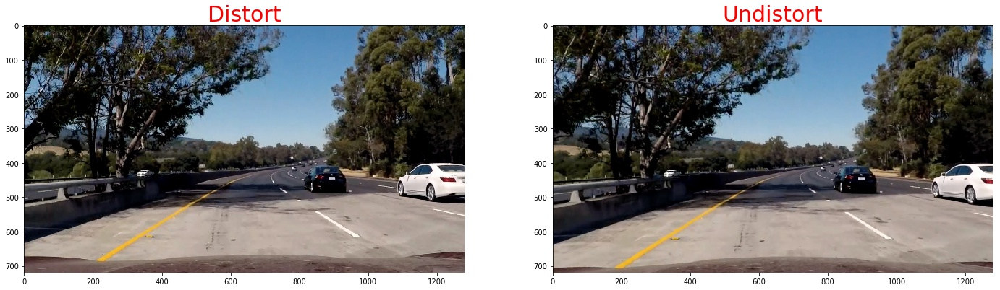


## Pipeline (single images)

### 1. Provide an example of a distortion-corrected image.

To demonstrate this step, I will describe how I apply the distortion correction to one of the test images like this one:


### 2. Describe how (and identify where in your code) you used color transforms, gradients or other methods to create a thresholded binary image.  Provide an example of a binary image result.

I used a combination of color and gradient thresholds to generate a binary image.  Here's an example of my output for this step.  (note: this is not actually from one of the test images)


#### 1. We use sobel operator the take the gradient thresholds
 Calculate the derivative in the xx direction (the 1, 0 at the end denotes xx direction):  
`sobelx = cv2.Sobel(gray, cv2.CV_64F, 1, 0)`  

Calculate the derivative in the yy direction (the 0, 1 at the end denotes yy direction):
`sobely = cv2.Sobel(gray, cv2.CV_64F, 0, 1)`  
Taking the gradient in the xx direction emphasizes edges closer to vertical. Alternatively, taking the gradient in the yy direction emphasizes edges closer to horizontal.

The magnitude, or absolute value, of the gradient is just the square root of the squares of the individual x and y gradients. For a gradient in both the xx and yy directions, the magnitude is the square root of the sum of the squares.
```python
sobel_xy = np.sqrt(sobel_x**2 + sobel_y**2)
scaled_xy = np.uint8(255 * sobel_xy / np.max(sobel_xy))
 ```   
 

 In the case of lane lines, we're interested only in edges of a particular orientation. So now we will explore the direction, or orientation, of the gradient.
 ```python
 sx_abs = np.absolute(cv2.Sobel(img, cv2.CV_64F, 1, 0, ksize=kernel_size))
sy_abs = np.absolute(cv2.Sobel(img, cv2.CV_64F, 0, 1, ksize=kernel_size))    
dir_sxy = np.arctan2(sx_abs, sy_abs)
```


the threshold we use is as below:

||   lower  | upper| 
|:---:|:-------------:|:-------------:| 
|sobel-x| 20     | 120  |
|sobel-y| 20     | 120  |
|Magnitude of the Gradient| 80  | 200  |
|Direction of the Gradient| np.pi/4|np.pi/2  |

now,we will combine them to get a batter result, since the sobel-x will detect line close vertical,we'll keep it all
```python
def combined_sobels(sx_binary, sy_binary, sxy_magnitude_binary,sxy_direction_binary):    
    combined = np.zeros_like(sxy_direction_binary)
    combined[(sx_binary == 1) | ((sy_binary == 1) & (sxy_magnitude_binary == 1) & (sxy_direction_binary == 1))] = 1
    return combined
```

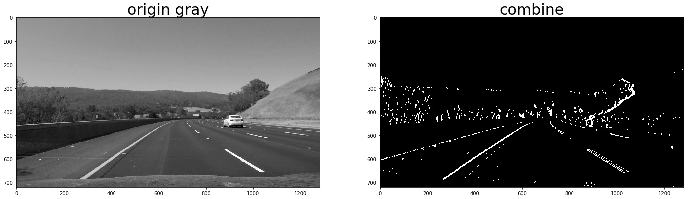


#### 2. Color Thresholding

```python
yellow_binary[((h >= 15) & (h <= 35))
                 & ((l >= 30) & (l <= 204))
                 & ((s >= 115) & (s <= 255))] = 1
white_binary = np.zeros_like(h)
white_binary[((h>= 0) & (h <= 255))
                 & ((l>= 200) & (l <= 255))
                 & ((s>= 0) & (s <= 255))] = 1
```
 
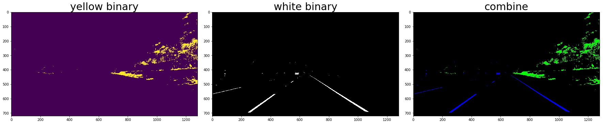
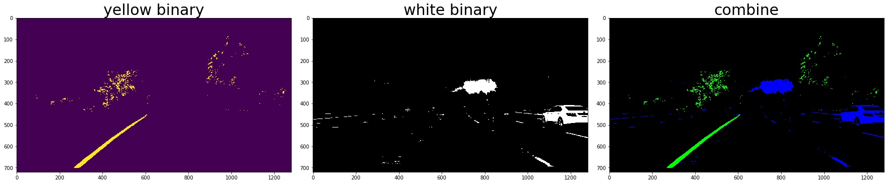
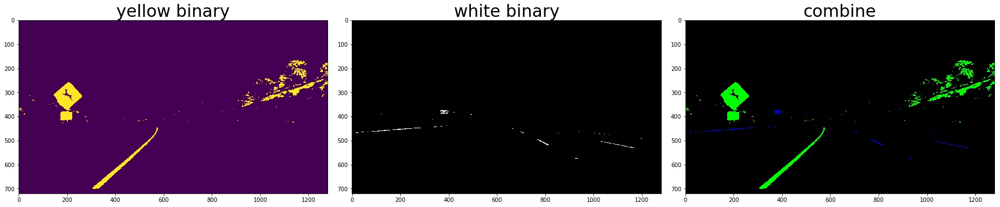
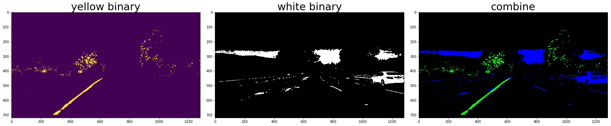


#### 3. Combine the gradient and color threshed 
```python
color_binary_combined = np.dstack((combined_grad, combined_yellow_white, np.zeros_like(combined_grad))) * 255
combined_binary = np.zeros_like(gray)
combined_binary[(combined_grad == 1)|(combined_yellow_white == 1)] = 1
```
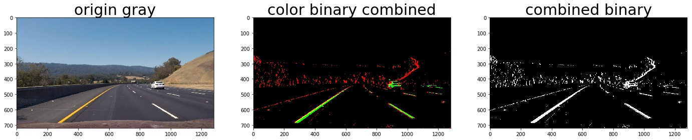
the red line is detected by gradient and the green is detected by color

### 3. Describe how (and identify where in your code) you performed a perspective transform and provide an example of a transformed image.

The code for my perspective transform includes a function called `warper()`, which appears in lines 1 through 8 in the file `example.py` (output_images/examples/example.py) (or, for example, in the 3rd code cell of the IPython notebook).  The `warper()` function takes as inputs an image (`img`), as well as source (`src`) and destination (`dst`) points.  I chose the hardcode the source and destination points in the following manner:

```python
src = np.float32(
    [[(img_size[0] / 2) - 55, img_size[1] / 2 + 100],
    [((img_size[0] / 6) - 10), img_size[1]],
    [(img_size[0] * 5 / 6) + 60, img_size[1]],
    [(img_size[0] / 2 + 55), img_size[1] / 2 + 100]])
dst = np.float32(
    [[(img_size[0] / 4), 0],
    [(img_size[0] / 4), img_size[1]],
    [(img_size[0] * 3 / 4), img_size[1]],
    [(img_size[0] * 3 / 4), 0]])
```
note:the points should be clock-wise and start from the left-bottom, the **src** and the **des** should have the same orders otherwise the result picture will be upside down or twisted.

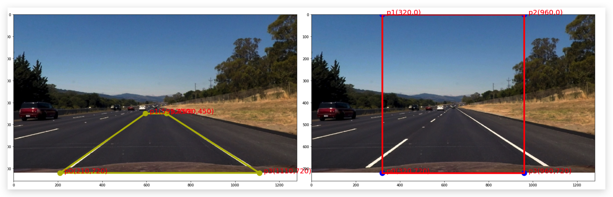
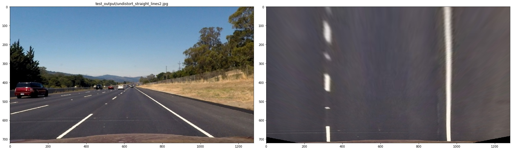
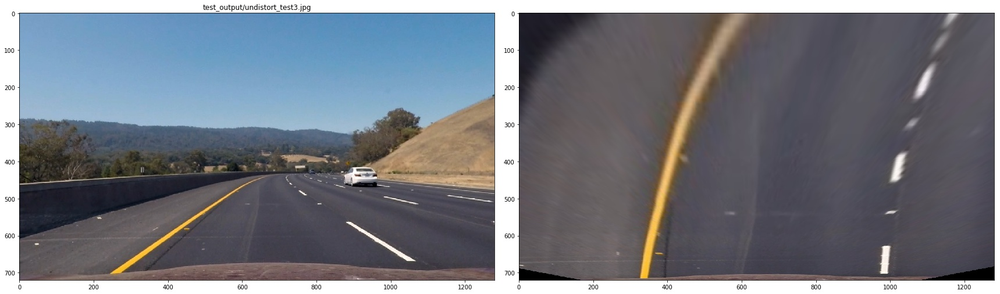


#### 4. Describe how (and identify where in your code) you identified lane-line pixels and fit their positions with a polynomial?
 I plot the histogram of the bird-view image, then find the peek to decide the left base and right base of the lane lines
 
 
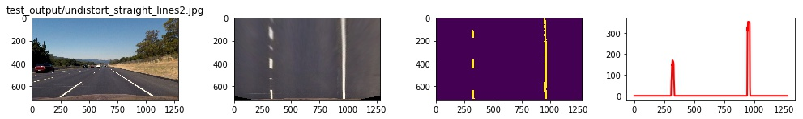
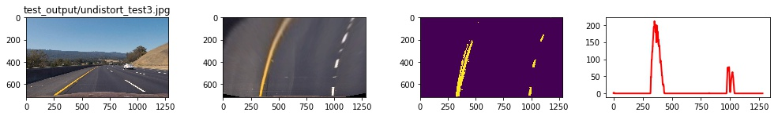

then we use **slide window** to find the lane pixels:
1. define 10 windows, the window's height is the height of image divide num of windows 
2. loop through those windows
    - Identify window boundaries in x and y (and right and left)
    - Identify the nonzero pixels in the image and their index
    - Identify the nonzero pixels in x and y within the window and append its index to each line
    -  If we found > minpix pixels, recenter next window, the new center is the mean of pixels' co
3. Extract left and right line pixel positions

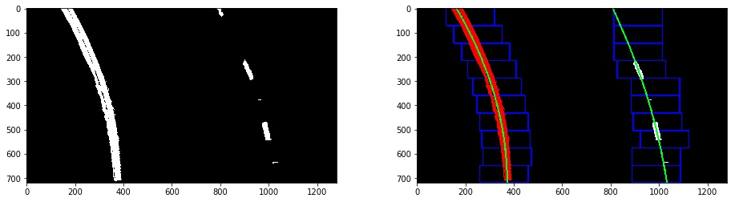

At last, we need to use polyfit function in numpy to find a line that is best fit the pixels of each line.
```python
# Find our lane pixels first
leftx, lefty, rightx, righty, out_img = find_lane_pixels(binary_warped)
left_fit = np.polyfit(lefty, leftx, 2)
right_fit = np.polyfit(righty, rightx, 2)
```

we can use list comprehension to make (x,y)
```python
pts_left=np.array([[x,y] for x,y in zip(left_fitx,ploty)],np.int32).reshape((-1,1,2))
pts_right=np.array([[x,y] for x,y in zip(right_fitx,ploty)],np.int32).reshape((-1,1,2))
```
but we can still use `np.vstack` to make (x,y)
```
left_line = np.array([np.transpose(np.vstack([left_fitx, ploty]))])
```

let me show you the result:
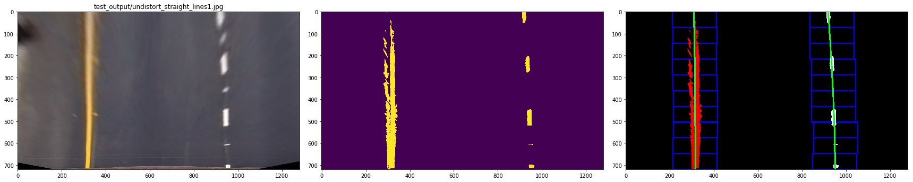
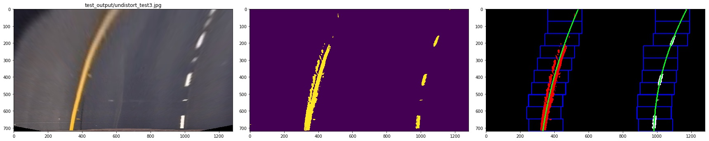
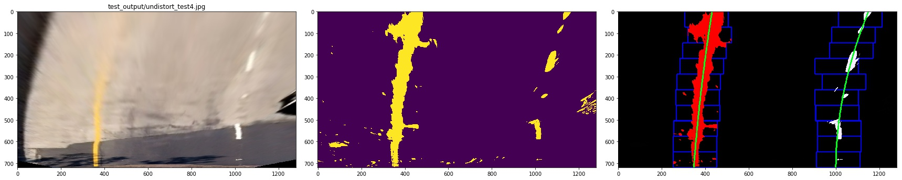


#### 5. Describe how (and identify where in your code) you calculated the radius of curvature of the lane and the position of the vehicle with respect to the center.

First, we define the transformation rules to trans image pixels to real world length
```python
ym_per_pix = 30/720 # meters per pixel in y dimension
xm_per_pix = 3.7/700 # 
lane_center_px_psp = 600
```
then we calculate  the radius of curvature of the lane
```python
left_curverad = ((1 + (2*left_fit_cr[0]*y_eval*ym_per_pix + left_fit_cr[1])**2)**1.5) / np.absolute(2*left_fit_cr[0])
right_curverad = ((1 + (2*right_fit_cr[0]*y_eval*ym_per_pix + right_fit_cr[1])**2)**1.5) / np.absolute(2*right_fit_cr[0])
center_offset = (((left_fit[0] * y_eval**2 + left_fit[1] * y_eval + left_fit[2]) + 
                   (right_fit[0] * y_eval**2 + right_fit[1] * y_eval + right_fit[2])) / 2) - lane_center_px_psp

center_offset = center_offset*xm_per_pix
```
to see it clearly, I combined the image as below:
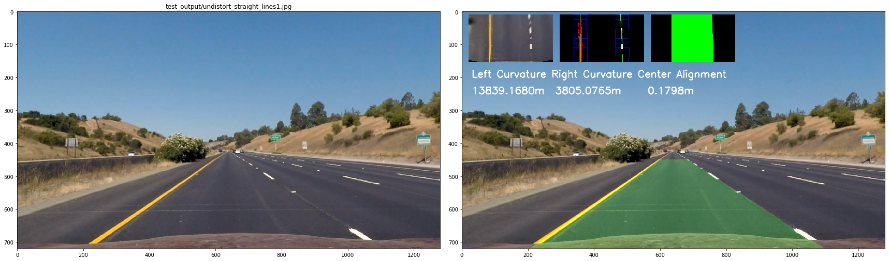
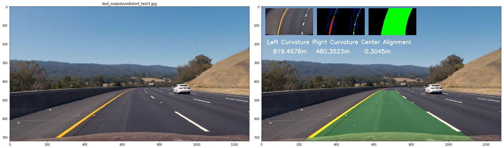
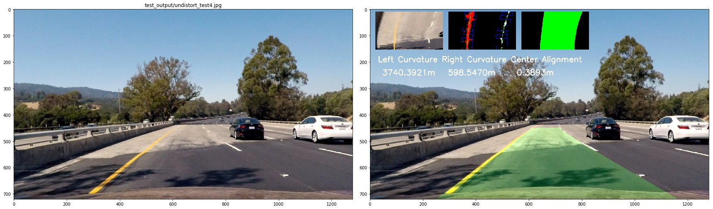


#### 6. Provide an example image of your result plotted back down onto the road such that the lane area is identified clearly.


---

### Pipeline (video)

#### 1. Provide a link to your final video output.  Your pipeline should perform reasonably well on the entire project video (wobbly lines are ok but no catastrophic failures that would cause the car to drive off the road!).

Here's a [link to my video result](https://www.youtube.com/watch?v=AoPu7QEHCx8&feature=youtu.be)

or [this one](./test_output/test.mp4)

---

### Discussion

#### 1. Briefly discuss any problems/issues you faced in your implementation of this project.  Where will your pipeline likely fail?  What could you do to make it more robust?

Here I'll talk about the approach I took, what techniques I used, what worked and why, where the pipeline might fail and how I might improve it if I were going to pursue this project further.  
